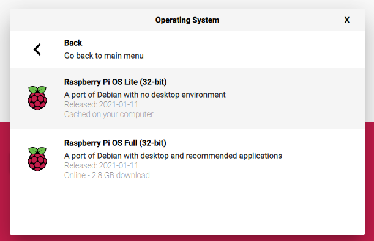
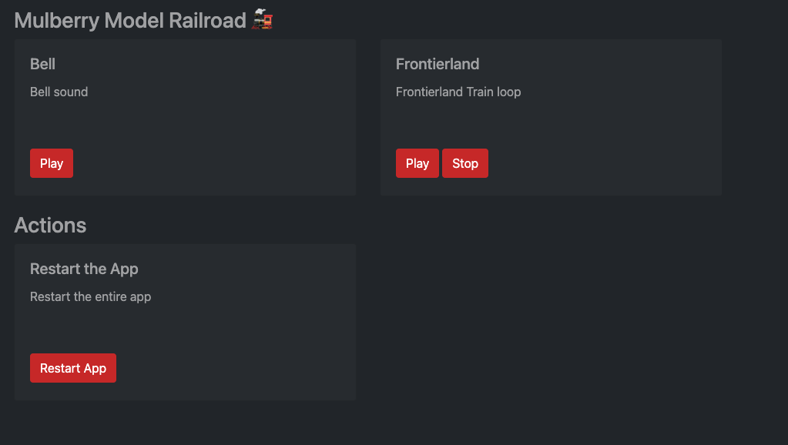

# Mulberry Model Railroad
*A dynamic sound generator for a model railroad.*

These instructions will take you through everything you need to get started with Mulberry Model Railroad and extending it with your own sound effects.

## Hardware
The hardware is very simple and costs less than £25. The only additional part is a battery. I’m using a small mobile phone charger which gives around 1-2 hours of runtime.

* 1x [Raspberry Pi Zero WH (pre-soldered)](https://shop.pimoroni.com/products/raspberry-pi-zero-wh-with-pre-soldered-header)
* 1x [Mini Speaker 4Ω (3W)](https://shop.pimoroni.com/products/mini-speaker-4-3w)
* 1x [Audio Amp SHIM (3W Mono Amp)](https://shop.pimoroni.com/products/audio-amp-shim-3w-mono-amp)

*I am currently working on how we can power the pi directly from the tracks, if anyone has any insights to this please let me know.*

## Supported Platforms
This will only work on a Raspberry pi due to the use of `omxplayer`. There is a simple version (without media controls) which can be useful for debugging on Mac using `afplay`. To run the debug version `npm run mac`.

## Setup
First download and install a version of Raspberry Pi Lite OS onto an SD card. This is going to be used in a train so we don’t need a desktop environment.



To setup a Wi-Fi connection on your headless Raspberry Pi, create a text file called `wpa_supplicant.conf`, and place it in the root directory of the microSD card. You will need the following text in the file.

```
country=GB
ctrl_interface=DIR=/var/run/wpa_supplicant GROUP=netdev
update_config=1

network={
	scan_ssid=1
	ssid=“your_wifi_ssid”
	psk=“your_wifi_password”
}
```

Add an empty file named `ssh` to the root of the SD card we need that for SSH access.

Power on and we can ssh into the box, open up your preferred SSH client (terminal for Mac, putty for Windows). 

`ssh pi@IPADDRESS`

Where `IPADDRESS` is the IP address of your pi. There are lots of ways to find this out but the easiest is to log onto your router and see the address it was given. It would also be a good idea to give it a static up address.

## Installing Node and NPM
After you have logged onto your server the first thing to do is to install Git.

`sudo apt install nodejs`

The raspberry pi zero has the ARM6 chipset and is limited to node 10. You will also find that NPM isn’t installed with this version of node.

`sudo apt install npm`

Once this are both installed you can copy the code from here.

`wget -O `

Unpack the code

`tar -`

Go into the folder `cd mmrr` and install the depdencies `npm install`. Once this has finished you can start the app.

`npm start`

Navigation to http://IPADDRESS:3000 and you should see this.



### Setup sound card

Create `.asoundrc`

```
pcm.hifiberry {
   type hw card 0
}

pcm.dmixer {
   type dmix
   ipc_key 1024
   ipc_perm 0666
   slave {
     pcm "hifiberry"
     period_time 0
     period_size 1024
     buffer_size 8192
     rate 44100
     channels 1
   }
}

ctl.dmixer {
    type hw card 0
}

pcm.!default {
        type plug
        slave.pcm "dmixer"
}
```

[Run your Node.js application on a headless Raspberry Pi - DEV Community](https://dev.to/bogdaaamn/run-your-nodejs-application-on-a-headless-raspberry-pi-4jnn)

`pm2 start npm --name=MMRR --watch -- run start` 

## Adding custom sounds

By default the app will only come with the bell sound, all other sounds I use are subject to copyright. You can use the `config.json` to define the sounds and actions available to them. You will intially see the following:

```
[{
  "name": "bell",
  "location": "/sounds/bell.mp3",
  "description": "Bell sound",
  "controls": []
}]
```
* `name` is the name of the effect for display purposes. 
* `location` is where it's placed along with the file name e.g. `/sounds/whistle.mp3`.
* `description` is a brief description for the UI.
* `controls` a list of available controls for this sound out of the options "loop", "speedup", "slowdown", "stop".

### Example
If we were going to add a steam sound we would update the config with the following:

```
{
  "name": "steam",
  "location": "/sounds/steam.mp3",
  "description": "Steam sound",
  "controls": ["loop", "speedup", "slowdown", "stop"]
}
```
This will show the buttons for the sound to loop, speedup, slowdown and stop.

## Keeping alive & loading on boot
We will use pm2 to keep the application alive and start it up on boot. We are following these [instructions](https://dev.to/bogdaaamn/run-your-nodejs-application-on-a-headless-raspberry-pi-4jnn).

`sudo npm install -g pm2` 

Then start the app

`pm2 start app.js`

PM2 then provides a script to load this on boot using `pm2 startup systemd`. You then need to copy the generated command and run it. Then run `pm2 save`.

## Enclosure
I have mounted all these components into an enclosure complete with an anker power pack. This gives me about 5 hours of use.
